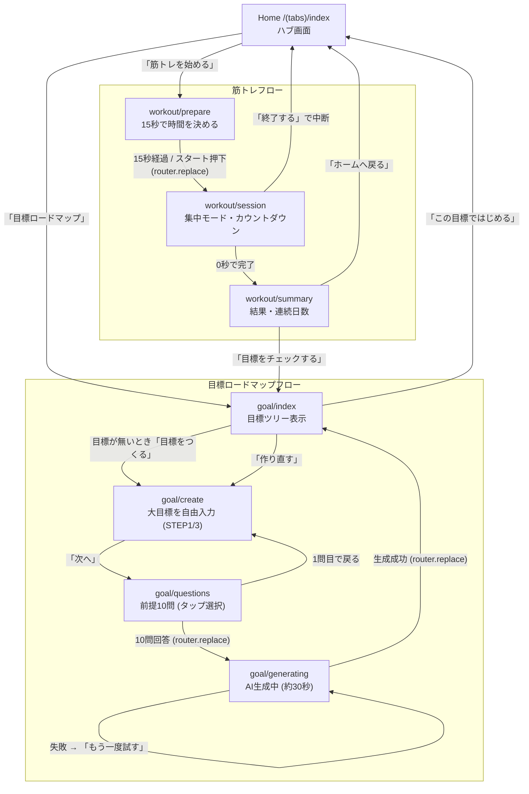

# ずぼらフィットネス — フロントエンド引継ぎ資料

対象アプリ: `apps/mobile`（Expo Router / React Native）
最終更新: 2026-07-17

このドキュメントは、実装済みのモバイルフロントエンド（画面・遷移・状態・バックエンド接合部）を引き継ぐためのものです。まずこのファイル一枚で全体像がつかめるようにし、詳細は各ソースへのリンクで辿れる構成にしています。

---

## 1. コンセプト（画面設計を理解するための前提）

「ずぼら（面倒くさがり）な人でも続けられる」ことを最優先にした筋トレアプリです。UIの意思決定はほぼこの一点に集約されています。

- **筋トレは開いた瞬間に15秒カウントダウンが自動で始まり、放置しても勝手にスタートする。** ユーザーに「決めさせない」。
- **目標設定はチャットではなく、自由入力1つ＋タップだけの10問。** 入力の手間を最小化し、あとはAIが目標をツリーに分解する。
- **配色は明るいティール基調。筋トレ中だけ濃いティール背景に切り替えて集中モードにする。**

---

## 2. 技術スタック

| 項目 | 採用 |
|---|---|
| フレームワーク | React Native `0.81.5` / React `19.1.0` |
| プラットフォーム | Expo `~54`（`expo` SDK 54） |
| ルーティング | **Expo Router `~6`**（ファイルベース・Stack + Tabs） |
| アニメーション | react-native-reanimated `~4.1` |
| ハプティクス | expo-haptics |
| バックエンド想定 | Supabase（`@supabase/supabase-js` 導入済み）＋ Gemini（ロードマップ生成） |
| 状態管理 | 外部ライブラリなし。画面ローカルの `useState` ＋ 軽量モジュールストア（後述） |

グローバルな状態管理ライブラリ（Redux/Zustand等）は入れていません。目標ウィザードの持ち回りのみ、モジュールスコープの簡易ストア `lib/goal-draft.ts` を使っています。

---

## 3. 画面遷移図



**遷移の実装メモ**

- `push` と `replace` を意図的に使い分けています。後戻りさせたくない箇所（`prepare→session`、`session→summary`、`questions→generating`、`generating→roadmap`）は `router.replace` で履歴を残しません。
- `session` と `summary` と `generating` は `_layout.tsx` で `gestureEnabled: false` を設定し、スワイプバックを禁止しています（誤操作で筋トレ・生成を中断させないため）。
- ルート定義は [`app/_layout.tsx`](app/_layout.tsx)、タブ定義は [`app/(tabs)/_layout.tsx`](app/(tabs)/_layout.tsx)。起動時アンカーは `(tabs)`。

---

## 4. ディレクトリ構成

```
apps/mobile/
├─ app/                       # Expo Router（= 画面 = URL）
│  ├─ _layout.tsx             # ルートStack。全画面のヘッダー/ジェスチャー設定
│  ├─ (tabs)/
│  │  ├─ _layout.tsx          # タブナビゲータ（Home / Explore）
│  │  ├─ index.tsx            # ★Home（ハブ）
│  │  └─ explore.tsx          # ※Expoテンプレの雛形。未使用（後述）
│  ├─ workout/
│  │  ├─ prepare.tsx          # 準備（15秒カウントダウン＋時間選択）
│  │  ├─ session.tsx          # 筋トレ本体（タイマー・一時停止）
│  │  └─ summary.tsx          # 記録サマリー
│  ├─ goal/
│  │  ├─ create.tsx           # 大目標の自由入力
│  │  ├─ questions.tsx        # 前提10問
│  │  ├─ generating.tsx       # AI生成中の待ち画面
│  │  └─ index.tsx            # 目標ツリー
│  └─ modal.tsx               # ※テンプレ残り。未使用
├─ components/
│  ├─ workout/
│  │  ├─ drum-roll-picker.tsx # 時間選択のドラムロールUI
│  │  └─ depleting-bar.tsx    # 減っていく進捗バー
│  └─ ui/, その他             # ※大半がExpoテンプレ由来
├─ constants/
│  ├─ workout-theme.ts        # ★全画面共通の配色・寸法トークン
│  └─ goal-questions.ts       # 前提10問のデータ定義（データ駆動）
├─ lib/
│  ├─ goal-draft.ts           # 目標ウィザードの一時ステート保持
│  ├─ format-time.ts          # 秒→"mm:ss"
│  └─ haptics.ts              # 触覚フィードバックのラッパ
├─ services/
│  ├─ workoutService.ts       # ★筋トレのデータ層（現状スタブ）
│  └─ goalService.ts          # ★目標生成のデータ層（現状スタブ）
└─ types/
   ├─ workout.ts              # 筋トレの共有型（フロント⇔バックの契約）
   └─ goal.ts                 # 目標の共有型（Gemini response_schema 準拠）
```

---

## 5. 各画面の仕様

### Home — `app/(tabs)/index.tsx`
アプリのハブ。上部に「連続記録」「今週の合計」の実績カード、下部に目標ロードマップへの導線と、メインCTA「筋トレを始める」。連続日数は `fetchStreakDays()`（現状スタブで固定値5）から取得。CTAで `workout/prepare` へ、目標リンクで `goal` へ。

### 筋トレフロー

**Prepare — `app/workout/prepare.tsx`**
このアプリの肝。画面表示と同時に `PREP_SECONDS = 15` のカウントダウンが走り、`0` になると **その時点で選ばれている時間・強度のまま自動で `session` へ**遷移します。手動で「◯分でスタート」も可。
- 時間選択は `DrumRollPicker`。候補は `getDurationOptions()` 由来（現状 1〜60分の固定リスト）。
- 強度は `easy / normal / hard` の3チップ（ラベルは `LEVEL_LABELS`）。
- 選択値は `ref`（`minutesRef` / `levelRef`）にも持たせ、カウントダウン0秒時の自動スタートで最新値を参照。二重遷移は `startedRef` でガード。

**Session — `app/workout/session.tsx`**
`durationSec` と `level` をクエリパラメータで受け取り、残り時間を大きく表示。濃ティール背景（`WorkoutColors.deep`）で集中モードに切り替わる。
- タイマーは `Date.now()` ベース（終了予定時刻 `endTimeRef` を保持）。再レンダリングや一時停止で誤差が出ない設計。表示更新は `TICK_MS = 200ms`。
- 進捗は `DepletingBar`（減っていくバー）。
- 一時停止／再開あり。完了（0秒）で `saveWorkoutSession()` を呼び、結果パラメータ付きで `summary` へ `replace`。「終了する」は中断として記録しHomeへ。
- パラメータは `clampNumber`（60秒〜90分、不正値は15分）と `normalizeLevel` で防御的にパースしている。

**Summary — `app/workout/summary.tsx`**
実施時間・目標・連続日数の3カードを表示。`completed` フラグで文言を出し分け（完走「おつかれさま！」／中断「ナイスファイト！」）。「目標をチェックする」で `goal` へ、「ホームへ戻る」でHomeへ（どちらも `replace`）。

### 目標ロードマップフロー

**Create — `app/goal/create.tsx`**
`STEP 1 / 3`。自由入力のテキストフィールド1つだけ（最大120字）。入力があれば「次へ」で `questions` へ。入力値は `goalDraft.setGoalText()` に保存。

**Questions — `app/goal/questions.tsx`**
[`constants/goal-questions.ts`](constants/goal-questions.ts) の `GOAL_QUESTIONS` 配列を1問ずつ描画する**データ駆動**画面。質問の増減・文言変更はこの定数ファイルだけで完結します。
- 質問種別は3つ: `single`（単一選択）/ `boolean`（はい・いいえ）/ `multi`（複数選択）。
- `single`・`boolean` は **タップした瞬間に自動で次の質問へ**（180ms後）。`multi`（器具選択など）はトグルして「次へ」。`exclusiveValue`（例: 自重のみ `none`）は他の選択肢と排他。
- 上部にプログレスバーと `n / 10` を表示。戻るは1問目で `router.back()`、それ以外は前の質問へ。
- 回答は `goalDraft.setAnswer()` に貯め、質問切替時に下書きから選択状態を復元。最終問で `generating` へ `replace`。

**Generating — `app/goal/generating.tsx`**
マウント時に `generateRoadmap(goalDraft.toInput())` を実行。本番は約30秒かかる想定で、3つのドットが明滅する待ち画面で間を持たせる。成功したら `goalDraft.setRoadmap()` に載せて `goal` へ `replace`、失敗したらエラー文＋「もう一度試す」。

**Roadmap — `app/goal/index.tsx`**
AIが分解した目標ツリー（大目標 → 中目標マイルストーン → 週次タスク）を縦のタイムラインで表示。生成直後は下書き（`goalDraft.getRoadmap()`）を、通常は保存済み（`fetchCurrentRoadmap()`）を表示。目標が無ければ空状態＋「目標をつくる」。「この目標ではじめる」でHomeへ、「作り直す」で下書きをリセットして `create` へ。

---

## 6. デザインシステム — `constants/workout-theme.ts`

**色を変えたいときは基本ここだけ触れば全画面に反映されます。**（ファイル名は歴史的経緯で `workout-theme` ですが、アプリ全体で参照）

| トークン | 値 | 用途 |
|---|---|---|
| `primary` | `#1D9E75` | メインのティール（ボタン・アクセント） |
| `onAccent` | `#FFFFFF` | アクセント上の文字 |
| `deep` | `#04342C` | 集中背景（筋トレ画面・生成中画面） |
| `ink` | `#0F6E56` | 見出し・タグ文字の中間ティール |
| `mist` | `#E1F5EE` | 淡い塗り・ピル・選択ハイライト |
| `soft` | `#9FE1CB` | 淡いボーダー・仕切り |
| `accent` | `#5DCAA5` | プログレスの塗り |
| `screenBg` | `#F4F7F5` | 画面の地（オフホワイト） |
| `surface` | `#FFFFFF` | カード面 |
| `textPrimary` | `#04342C` | 主要テキスト |
| `textSecondary` | `#5F6B66` | 補助テキスト |
| `textMuted` | `#9AA5A0` | ヒント・キャプション |
| `border` | `#E3ECE8` | ボーダー |

レイアウトトークン `WorkoutLayout`: `radiusCard: 22` / `radiusControl: 14` / `drumItemHeight: 56` / `drumVisibleCount: 5`。

> **注意:** 現状ダークモード対応は入っていません（明るいティール固定運用）。`app/_layout.tsx` に `useColorScheme` の分岐は残っていますが、画面側は `WorkoutColors` 直参照です。

---

## 7. バックエンド接合部（フロントは触らない前提の境界）

**フロントは `services/` の関数シグネチャと `types/` の型だけに依存しています。** バックエンドは各サービスの中身（現状スタブ）を実データ通信へ差し替えるだけで結合できる設計です。**関数名・引数・戻り値の型は変えない**でください（変えるとUI修正が必要）。置き換え箇所は各ファイル内で `TODO(backend):` にマークされています。

`services/workoutService.ts`
- `getDurationOptions()` — ドラムロールの時間候補（固定リスト）
- `fetchDefaultDurationSec()` — 初期選択時間
- `saveWorkoutSession(result)` — 筋トレ結果の保存（Supabase `workout_sessions` 想定）
- `fetchStreakDays()` — 連続達成日数

`services/goalService.ts`
- `generateRoadmap(input)` — 前提入力から目標ツリー生成（**Gemini** 呼び出しに差し替え。`gemini-3.5-flash`、レイテンシ約30秒。`response_schema` に `Roadmap` 構造を必須で渡すこと）
- `fetchCurrentRoadmap()` — 保存済みロードマップ取得

型の契約は [`types/workout.ts`](types/workout.ts) と [`types/goal.ts`](types/goal.ts)。`goal.ts` は設計ドラフトのJSONスキーマ（Gemini `response_schema`）に準拠しています。

---

## 8. 引き継ぎ時の注意点・TODO

- **`app/(tabs)/explore.tsx` と `app/modal.tsx` はExpoテンプレートの雛形が残っているだけで未使用。** `components/` 配下も `themed-text` / `parallax-scroll-view` など多くがテンプレ由来です。プロダクトの本体は `workout/` `goal/` と `components/workout/` の2つ。整理（削除 or 差し替え）が最初のタスク候補。
- **状態はメモリ保持のみ。** `goal-draft.ts` はモジュールスコープ変数のため、アプリを閉じると消えます。ドラフトの永続化が必要なら要検討。
- **ダークモード未対応**（前述）。
- **`services/` は全てスタブ。** フロント単体で通しで動作確認できますが、`saveWorkoutSession` はコンソール出力のみ、`fetchStreakDays` は固定値5、ロードマップはモックのツリーを返します。
- 触覚フィードバック（`lib/haptics.ts`）は各操作に仕込み済み。

---

## 9. 起動方法

```bash
cd apps/mobile
npm install
npx expo start
```

Expo Go またはシミュレータで起動。バックエンド未接続でも全画面がスタブで通して動きます。
